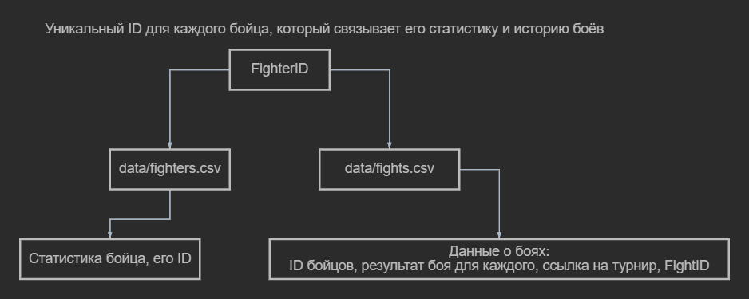
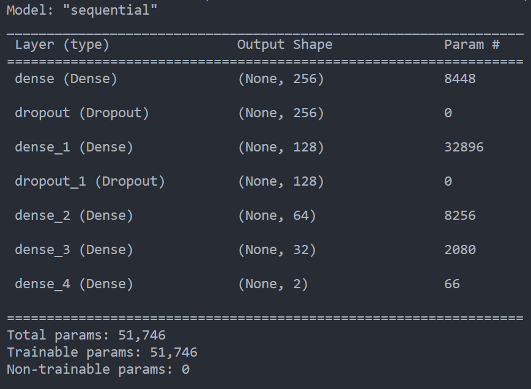

# Модуль `parser/`

## Подмодуль `preprocess.py`
Подмодуль выполняет предобработку данных
### **Как работает `preprocess (fp_fighters: str, fp_fights: str)`?**
Аргументы `fp_fighters` и `fp_fights` - пути до соотвествующих данных
 
Есть `data/fighters.csv` и `data/fights.csv`. Как показано на схеме выше, они связаны между собой `FighterID`. 
**Что делает** `preprocess.py`? 
- Очищает данные `data/fighters.csv` и `data/fights.csv` от "пустых" значений
- Преобразует значения из столбцов `Result_1`, `Result_2` `data/fights.csv` в цифровые
- Создает `train_list` - список, в котором будут храниться все `train_dict`
- Идёт в цикл по `data/fights.csv`
- Создает словарь `train_dict`, где будет храниться вся статистика боя
- Копирует данные из `data/fights.csv` в `train_dict`
- Не выходя из первого цикла по `data/fights.csv` идет в цикл `for j in range(1,2+1)` ( начинается с 1, тк в `data/fights.csv` столбцы `FighterID_1`, `Result_1` и т.д)
- Ищет статистику в `data/fighters.csv` по `FighterID` из `train_dict` ( сами ключи `FighterID_{i}` со значениями из `train_dict` удаляются)
- Создает `pd.DataFrame` с `data=train_list`
- Разделяет его на `X` и `Y`
- Нормализует `X`
- **Возвращает** список `result` с нормализованным X и ненормализованным Y

## Подмодуль `model.py`
Подмодуль создает архитектуру модели и коллбеки для неё
### Архитектура модели:
- Модель: **Sequential**
- **Входной** слой: **нейронов: 256**, **функция активации: Tanh**
- Слой `Dropout`: **фактор: `0.4`**
- **Скрытый** слой: **нейронов: 128**, **функция активации: ReLu**
- - Слой `Dropout`: **фактор: `0.3`**
- **Скрытый** слой: **нейронов: 64**, **функция активации: ReLu**
- **Скрытый** слой: **нейронов: 32**, **функция активации: Tanh**
- **Выходной** слой: **нейронов: 2**, **функция активации: Softmax** 
 
**Функция-оптимизатор:** `Adam`, **скорость обучения:** `0.0001`
**Функция потерь:** `categorical_crossentropy`
**Метрики**: `["accuracy"]`

